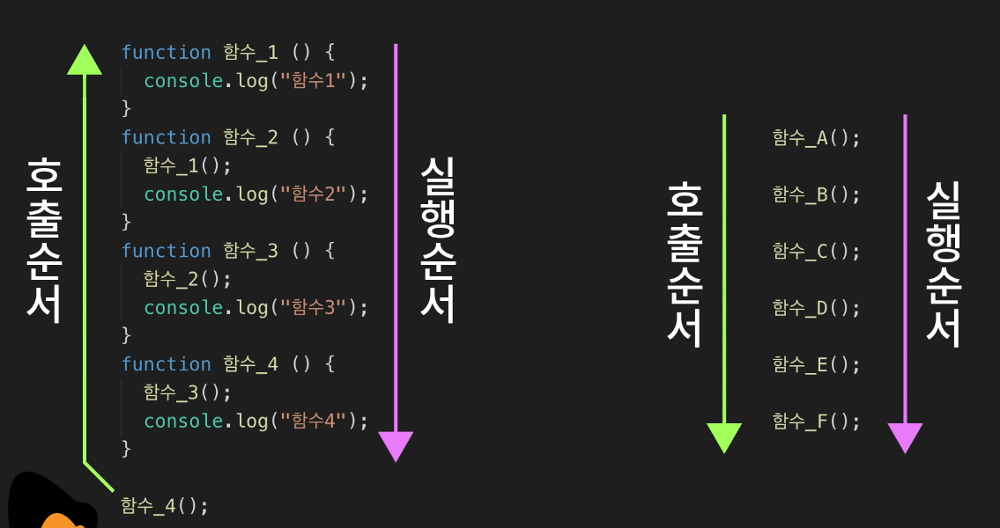
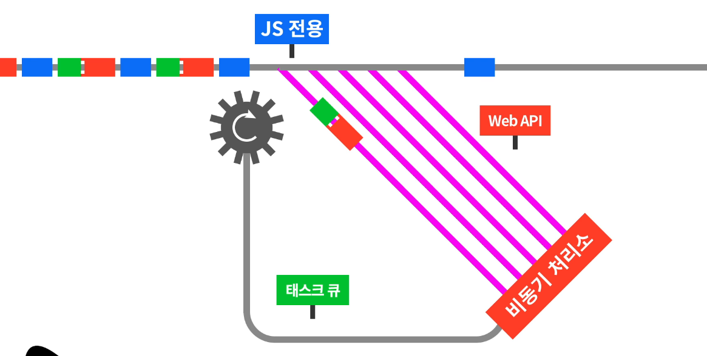
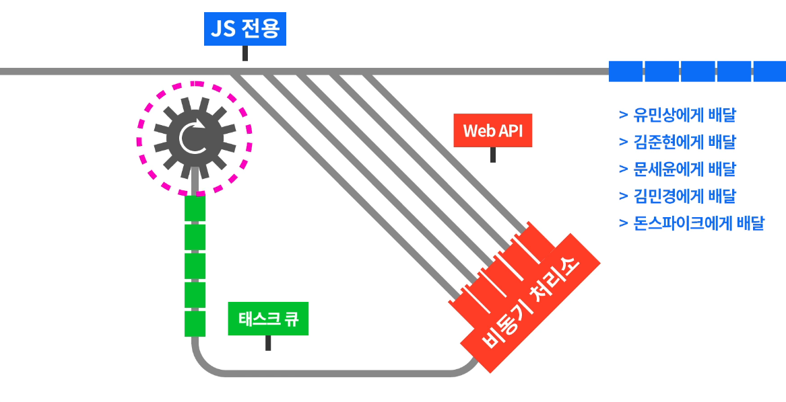

# 비동기 프로그래밍

https://youtu.be/m0icCqHY39U

프로그램이 비동기로 일한다는 건 스레드나 프로세스가 여럿이 돌고있다는 소리. 즉, 멀티태스킹이 구현되고 있는 것.

- 동기 : 동일한 기찻길에 놓인 열차라고 보면 됨. 앞의 열차가 멈춰있으면 뒤의 열차가 나아갈 수 없다.
- 비동기 : 필요에 따라서 이동이 느리거나 자주 서는 열차를 다른 선로에 배치하는 것. 이렇게 하면 뒤의 열차가 막히지 않는다.

#### 자바스크립트는 싱글스레드인데도 비동기 작업이 가능한 이유?

자바 스크립트는 웹 브라우저나 Node.js의 자바스크립트 엔진에서 실행된다. 이 엔진에는 자바스크립트를 돌리는 하나의 스레드, 자바스크립트 함수 전용 선로가 있다.

- 선로는 선입선출의 큐 형태인데 함수는 후입선출의 스택으로 처리되는게 아닌가?

  => 그렇다. 다른 포함 레벨의 함수들이 처리되는 순서는 역순임. BUT 같은 포함 레벨에서의 함수들은 순서대로 처리되니까 같은 레벨에서의 함수들을 한 선로 위의 열차로 비유해보고자 한다.

자바스크립트가 도는 환경에는 이 엔진뿐 아니라 Web API라는 것이 함께 동작한다.

- Web API : 타이머를 사용한 작업을 하거나 AJAX로 http 요청을 보내거나 파일에서 데이터를 읽어오는 등 시간을 소요하는 작업들을 수행.

 열차가 들어오면 pc는 이 일을 js 전용 선로가 아닌 브라우저나 Node.js에서 운영하는 비동기 작업용 선로에 올려둔다. 이 선로는 한번에 여럿이 만들어질 수 있다.

비동기 작업용 선로에 들어간 열차들은 보통 '콜백 함수'를 갖고 있다. 시간이 걸리는 이동을 마친 열차들은 비동기 처리 톨게이트에 도착한 순서대로 태스크 큐라는 선로에 콜백 함수를 실어 보냄.

이 콜백 함수들은 태스크 큐 선로를 따라 js 선로로 다시 돌아오게 되는 것. 태스크 큐 선로에 물레방아처럼 계속 돌아가는 한 장치가 비동기 작업이나 클릭 등의 사용자 입력으로부터 태스크 큐를 타고 들어오는 콜백 함수들을 기다리고 있다. 콜백 함수들이 도착하는대로 js 선로에 올려서 이 콜백 함수들이 자바스크립트에서 실행되도록 하는 이 장치를 **'이벤트 루프'**라고 한다.

하지만 코드를 잘못짜면 **콜백 지옥**에 빠질수 있다.

=> 이러한 문제를 해결하기위해 ES6버전부터 **Promise**를 도입.

then 함수(`.then`)를 통해 체이닝 방식으로 비동기 작업들을 순차적으로 처리.

