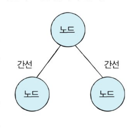
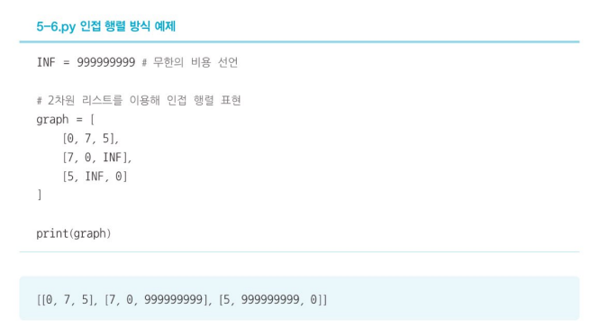
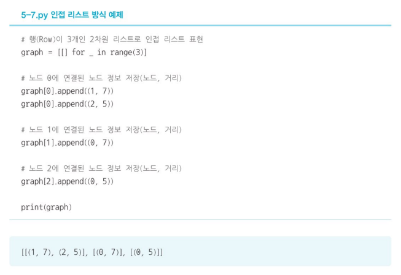
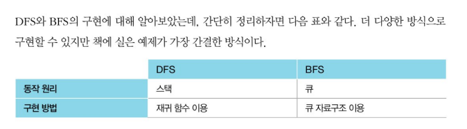

#  DFS/BFS

> 정리 : DFS(스택, 깊이 우선 탐색) / BFS(큐, 너비 우선 탐색)

- 탐색 : 많은 양의 데이터 중에서 원하는 데이터를 찾는 과정

- 자료구조 : 데이터를 표현하고 관리하고 처리하기 위한 구조

- 스택과 큐는 자료구조의 기초 개념으로 다음 두 핵심적인 함수로 구성된다
  - 삽입(push) : 데이터를 삽입
  - 삭제(pop) : 데이터를 삭제

- 삽입, 삭제 외에도 오버플로, 언더플로를 고민해야 함.

  - 오버플로 : 특정한 자료구조가 수용할 수 있는 데이터의 크기를 이미 가득 찬 상태에서 삽입연산을 수행할 때 발생한다.
  - 언더플로 : 자료구조에 데이터가 전혀 없을때 삭제 연산을 수행하면 발생

  

## 스택

- 선입후출 또는 후입선출 구조

- `append()`와 `pop()` 메서드 사용

- 최하단부터 출력`print(stack)`, 최상단부터 출력은 `print(stack[::-1])`

  

## 큐

- 선입선출 구조
- 큐 구현을 위해 `deque` 라이브러리 사용
- `append()`와 `popleft()` 메서드 사용
- 먼저 들어온 순서대로 출력`print(queue)`, 다음 출력을 위해 역순으로 바꾸기 `queue.reverse()`, 나중에 들어온 원소부터 출력 `print(queue)`

## 재귀 함수

- 자기 자신을 다시 호출하는 함수

### 재귀함수의 종료 조건

- 재귀 함수가 언제 끝날지 종료 조건을 꼭 명시해야 함
- 재귀 함수는 내부적으로 스택 자료구조와 동일하다

- 따라서 스택 자료구조를 활용해야 하는 상당수 알고리즘은 재귀 함수를 이용해서 간편하게 구현될 수 있다(ex: DFS)

  

## 탐색 알고리즘 DFS/BFS

### DFS

- 깊이 우선 탐색, 그래프에서 깊은 부분을 우선적으로 탐색하는 알고리즘

- 인접 행렬 : 2차원 배열로 그래프의 연결 관계를 표현하는 방식

- 인접 리스트 : 리스트로 그래프의 연결 관계를 표현하는 방식

- 메모리와 속도 측면에서 **인접 행렬 방식**은 모든 관계를 저장하므로 노드 개수가 많을수록 **메모리가 불필요하게 낭비**된다. 반면 **인접 리스트 방식**은 연결된 정보만을 저장하기 때문에 메모리를 **효율적으로 사용**한다.

- 하지만 **인접 리스트 방식**은 인접 행력 방식에 비해 특정한 두 노드가 연결되어 있는지에 대한 정보를 얻는 속도가 느리다.

- DFS 동작과정
  1. 탐색 시작 노드를 스택에 삽입하고 방문 처리한다.
  2. 스택의 최상단 노드에 방문하지 않은 인접 노드가 있으면 그 인접 노드를 스택에 넣고 방문 처리를 한다. 방문하지 않은 인접 노드가 없으면 스택에서 최상단 노드를 꺼낸다.
  3. 2번의 과정을 더이상 수행할 수 없을 때까지 반복한다.

- **DFS**는 스택 이용

### BFS

- 너비 우선 탐색, 가까운 노드부터 탐색하는 알고리즘
- BFS 동작과정
  1. 탐색 시작 노드를 큐에 삽입하고 방문 처리한다.
  2. 큐에서 노드를 꺼내 해당 노드의 인접 노드 중에서 방문하지 않은 노드를 모두 큐에 삽입하고 방문 처리를 한다.
  3. 2번의 과정을 더이상 수행할 수 없을 때까지 반복한다.

