## 백트래킹?
- 여러가지 선택지(옵션)들이 존재하는 상황에서 한가지를 선택한다.
- 선택이 이루어지면 새로운 선택지들의 집합이 생성된다.
- 이런 선택을 반복하면서 최종 상태에 도달한다.
> 올바른 선택을 계속하면 목표 상태(goal state)에 도달한다.


## 백트래킹과 DFS의 차이
- **Prunning(가지치기)** : 유망하지 않은 경로를 따라가지 않음으로써 시도의 횟수를 줄임.
- DFS는 모든 경로를 추적하지만 백트래킹은 불필요한 경로를 조기에 차단.
- DFS를 가하기에는 경우의 수가 너무나 많음. 즉 `N!`가지의 경우의 수를 가진 문제에 대해 DFS로 탐색하면 당연히 처리 불가능한 문제.
- 백트래킹 알고리즘을 적용하면 일반적으로 경우의 수가 줄어들지만 이 역시 최악의 경우에는 여전히 **지수함수 시간**(Exponential Time)을 요하므로 처리 불가능


## 백트래킹 기법
- 어떤 노드의 유망성 점검 후 유망(promising)하지 않다고 결정되면 그 노드의 부모로 되돌아가(backtracking) 다음 자식 노드로 감
- 어떤 노드를 방문하였을 때 그 노드를 포함한 경로가 해답이 될 수 없으면 그 노드는 유망하지 않다고 하며, 반대로 해답의 가능성이 있으면 유망하다고 한다.
- **Prunning(가지치기)** : 유망하지 않은 노드가 포함되는 경로는 더이상 고려하지 않는다.

### 백트래킹 알고리즘 절차
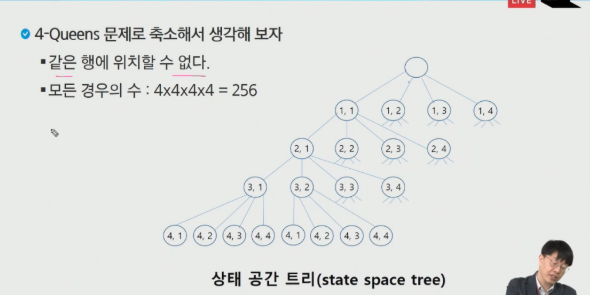

1. 상태 공간 트리의 깊이 우선 검색을 실시
2. 각 노드가 유망한지를 점검
3. 만일 그 노드가 유망하지 않으면, 그 노드의 부모로 돌아가서 검색 재개

### 일반 백트래킹 알고리즘
```python
checknode (node v):
	if promising(V):
    	if there is a solution at v:
        	write the solution
        else:
        	for each child u of v:
            	checknode(u)
```

### 상태공간트리를 구축해 문제 해결
```python
bool backtrack(선택 집합, 선택한 수, 모든 선택수) {
	if (선택한 수 == 모든 선택수) # 더 이상 탐색할 노드가 없다.
    {
    	찾는 솔루션인지 체크;
    	return 결과;
    }
    현재 선택한 상태 집합에 포함되지 않는 후보 선택들(노드) 생성
    
    모든 후보 선택들에 대해
    {
    	선택 집합에 하나의 후보선택을 추가
        선택한 수 = 선택한 수 + 1
        결과 = backtrack 호출(선택 집합, 선택한 수, 모든 선택수)
        
        if (결과 == 성공)
        	return 성공; # 성공한 경우 상위로 전달
    }
    return 실패;
}
```

### {1, 2, 3}의 전체 부분집합을 구하는 백트래킹

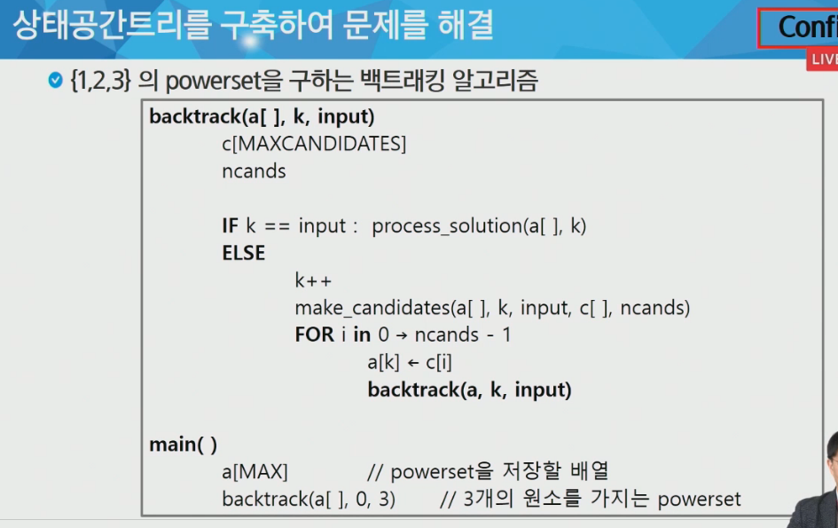

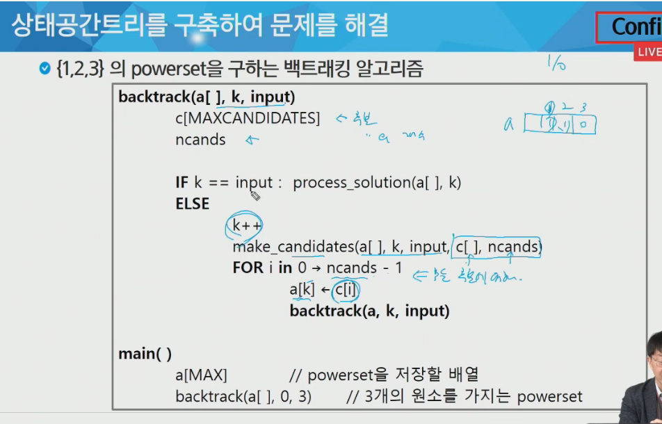

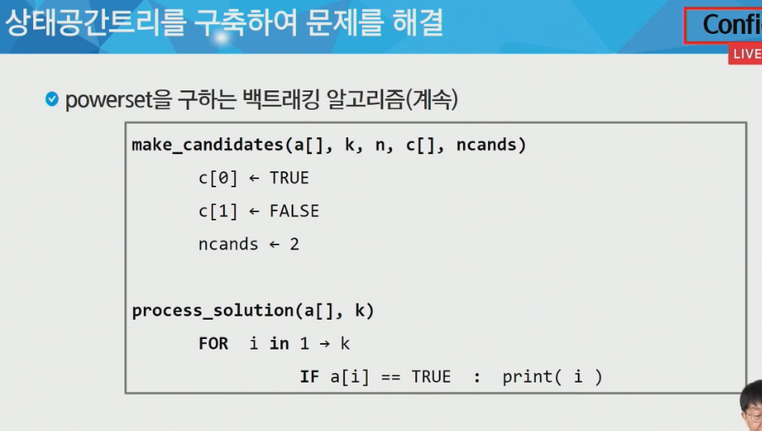

```python
def backtrack(a[], k, input):
    c[MAXCANDIDATES]    # 후보의 집합을 저장할 배열	
    ncands  # 후보의 개수
    
    if k == input : process_solution(a[], k)	# a는 1과 0으로 표시되는 배열(존재 유무 표시)
    else:
    	k++
    	make_candidates(a[], k, input, c[], ncands)	# make_candidates 호출해서 현재 상태 전달
    	for i in range(0, ncands-1):	# 모든 후보들에 대해서
	    	a[k] <- c[i] # append 해주기. k = 선택한 갯수
	    	backtrack(a, k, input)
            
main()
	a[MAX]	# 부분집합을 저장할 배열
    backtrack(a[], 0, 3)	# 3개의 원소를 가지는 부분집합   
    
```

```python
 make_candidates(a[], k, n, c[], ncands):
 	c[0]	# True
    c[1]	# False
    ncands <- 2
    
process_solution(a[], k):
    for i in range(1, k):
        if a[i] == True:
            print(i)
```

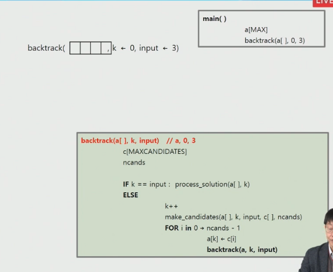

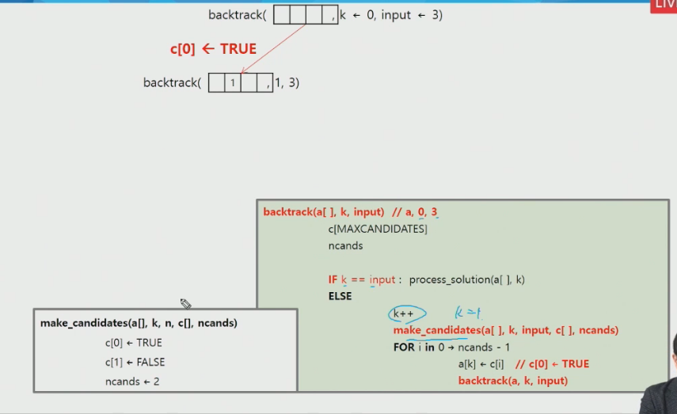

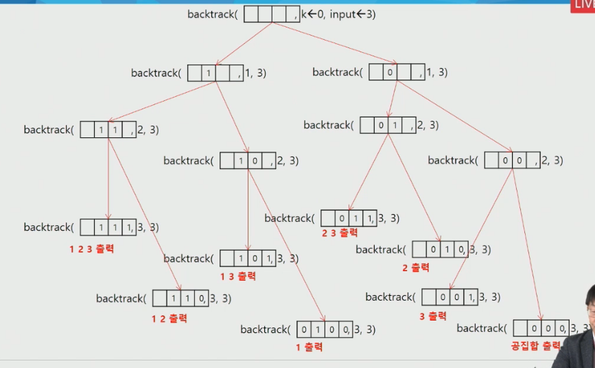

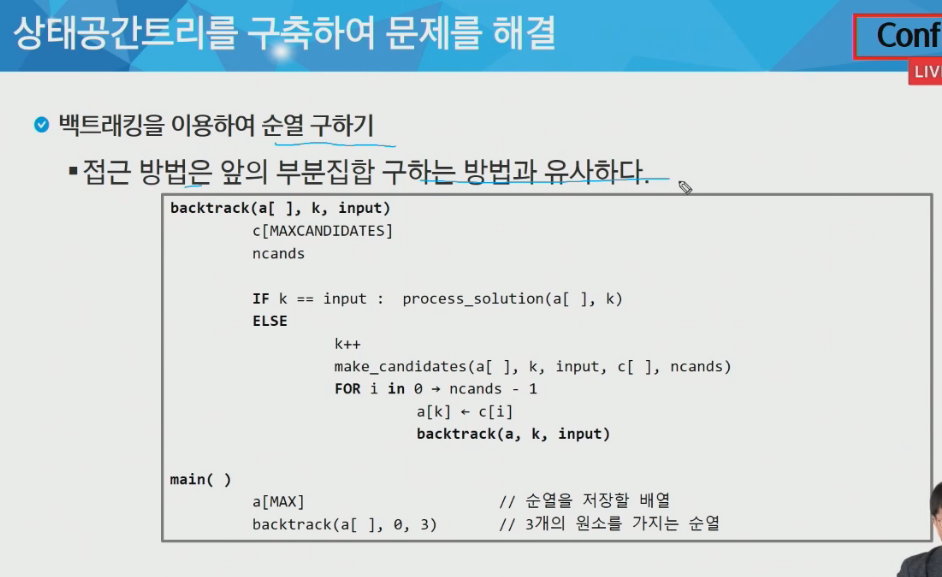

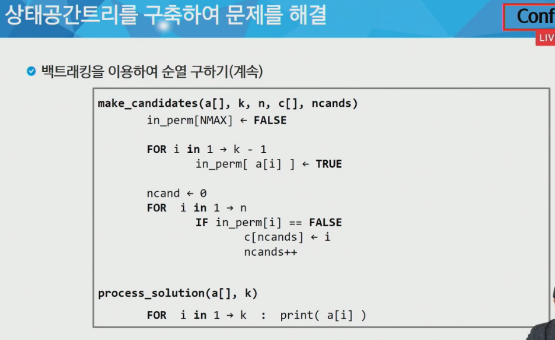

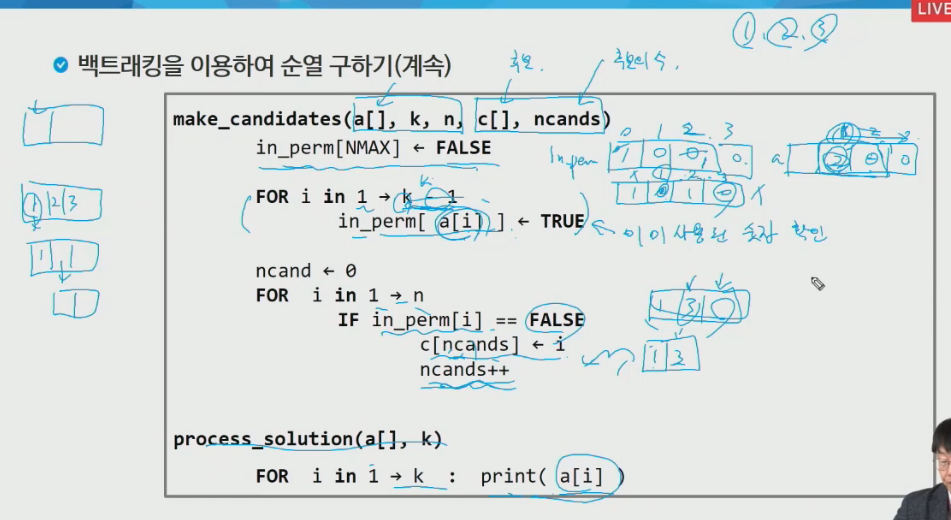

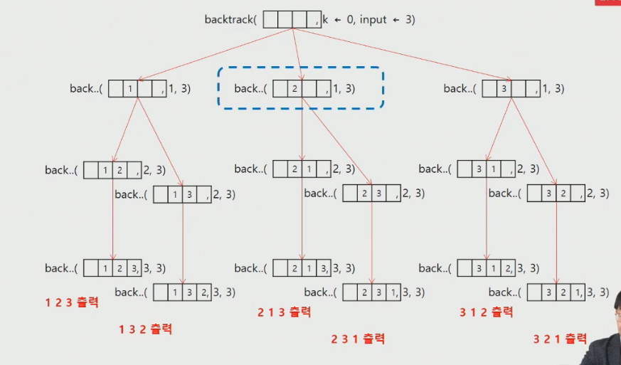

 