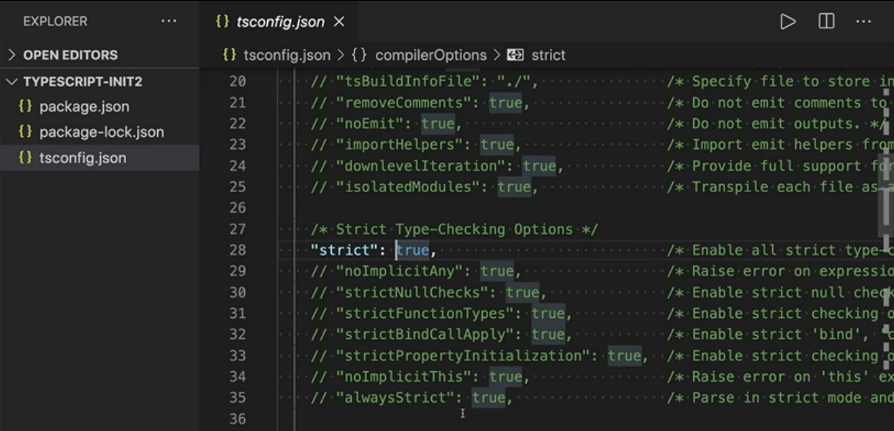
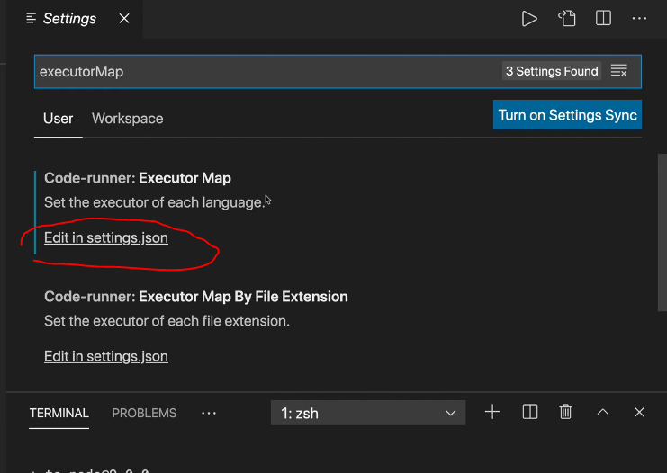
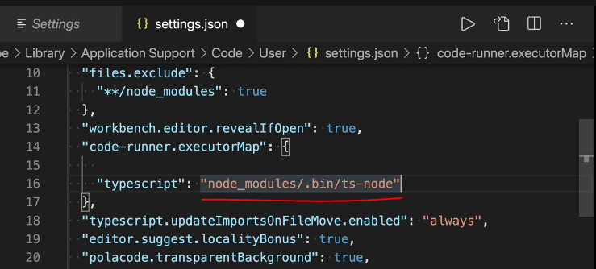
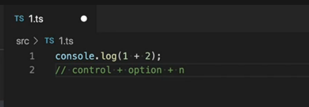

# TypeScript


### Typescript VS Javascript

| Typescript                        | Javascript                    |
| --------------------------------- | ----------------------------- |
| 정적 타입(static type)            | 동적 타입(dynamic type)       |
| 변수 타입이 compile time에 결정됨 | 변수 타입이 run time에 결정됨 |


- 정적타입 : 변수의 타입이 컴파일 타임에 결정됨

  - ex) Java, C++

- 동적타입 : 변수의 타입이 런타임에 결정됨

  - ex) Python, PHP


### 정적 타입 언어 VS 동적 타입 언어

| 정적 타입(static type) 언어         | 동적 타입(dynamic type) 언어     |
| ----------------------------------- | -------------------------------- |
| 진입 장벽 ⬆ (변수 선언시 타입 지정) | 진입 장벽 ⬇                      |
| 코드의 양이 많을때 생산성이 높다    | 코드의 양이 적을때 생산성이 높다 |
| 타입 오류가 컴파일 시 발견된다      | 타입 오류가 런타임 시 발견된다   |

DefinitelyTyped : 어떤 라이브러리의 타입 정의 파일이 있는지 검색 가능

https://www.typescriptlang.org/dt/search?search=

### 런타임 VS 컴파일타임

- **컴파일 타임 : ** 

  ```
  프로그램을 생성하기 위해 개발자는 첫째로 소스코드를 작성하고 컴파일이라는 과정을 통해 기계어코드로 변환 되어 실행 가능한 프로그램이 되며, 이러한 편집 과정을 컴파일타임(Compiletime) 이라고 부른다.
  ```

- **런 타임 : ** 

  ```
  컴파일 과정을 마친 프로그램은 사용자에 의해 실행되며, 이러한 응용프로그램이 동작되는 때를 런타임(Runtime)이라고 부른다.
  ```

  출처: https://spaghetti-code.tistory.com/35 [어떻게 짤것인가:티스토리]


### 타입스크립트 설치부터 컴파일까지

```bash
npm install typescript # 설치
npx tsc --init	# tsconfig.json 파일 (ts 설정 파일)
```



- 특별한 이유가 없다면 strict는 `true`로 설정. 이렇게 해야 ts의 장점을 살릴수 있음.
- 기존에 js로 되어있는 프로젝트를 ts로 포팅하는 경우에는 strict를 `false`로 해두고 각각의 strict 옵션을 true로 바꿔주면서 점진적으로 적용해나가는것도 괜찮은 방법임.

- ts 파일을 js로 컴파일 할땐 터미널에 `npx tsc` 입력
- ts에서 타입 정보는 컴파일 타임에만 사용된다.


### 타입스크립트 실행 방법 및 몇가지 팁

- lodash 설치

```bash
npm install lodash
```

`lodash`의 타입 정의 파일 `npm install @types/lodash` 설치.

그 후 `isEqual()` 함수 사용 가능.


- vs code 익스텐션 code runner 설치

code runner를 이용해서 타입스크립트를 컴파일 하기 위해선 ts-node 설치해야함.

```bash
npm install ts-node
```

`command + ,`눌러서 executorMap 검색. 빨간 동그라미 부분 클릭.





위와 같이 입력해주기.



실행하고 싶은 부분을 선택해 `control + option + n`을 눌러 실행 가능하다.

*[타입스크립트의 플레이그라운드 사이트](https://www.typescriptlang.org/play)를 이용해도 실행 가능하다.


- `command + .` 입력해서 자동 import (esc로 취소)
- `command + option + 화살표`로 멀티 커서 (esc로 취소)

- `export {}`를 사용하면 다른 파일에서 같은 변수 이름을 사용했을 때 생기는 오류를 막을 수 있다.
  - 빈 객체를 export 함으로써 ts가 이 코드를 모듈이라고 인식하게 만들어 해당 변수의 스코프를 해당 파일 안으로 제한시킴.
  - 즉 이름 충돌때문에 생기는 에러를 방지하기 위함.