# 타입 정의하기

### 기본 타입

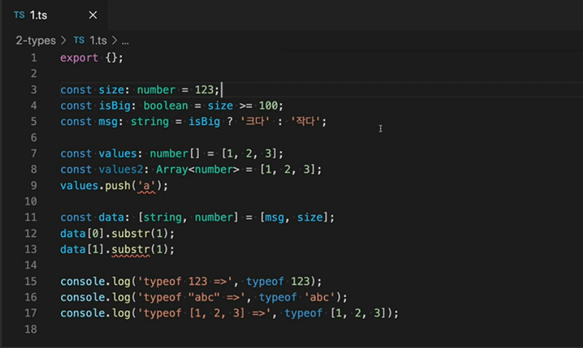

- 숫자의 배열 : `number[]` 
- 숫자의 배열 : `Array<number>` (위랑 같은 건데 표기만 다른거)
- 튜플 : `[string, number]` (각 index별로 미리 타입을 정의)

### undefined와 null

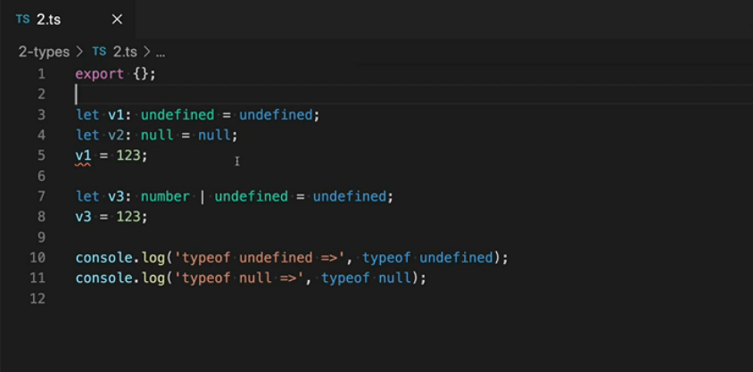

- js보다 타입을 풍부하게 정의 가능. undefined와 null도 각각 타입으로 정의할 수 있다.

- 보통 undefined나 null은 다른 타입과 함께 사용됨.
- `number | undefined`이런 형식으로. 여기서 `|`은 유니온 타입.

### 리터럴 타입

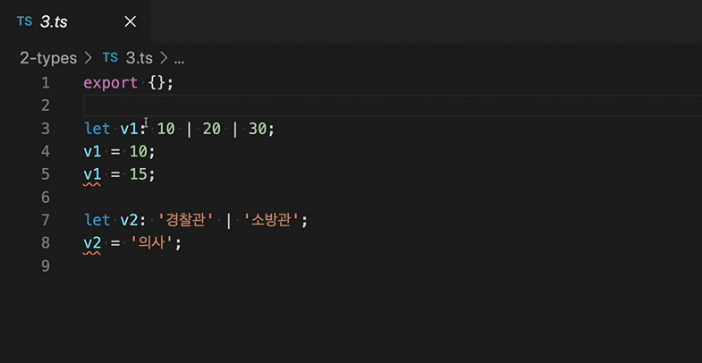

- ts는 숫자와 문자열의 리터럴도 타입으로 정의 가능.
- v1은 10 or 20 or 30을 값으로 가질 수 있는 타입. 따라서 15는 에러.

### any 타입

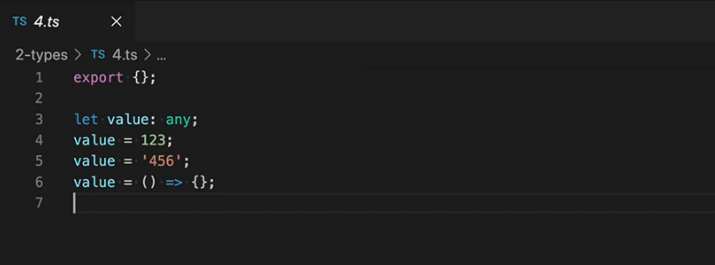

- `any`는 모든 값을 포함하는 타입.
- 숫자, 문자, 함수도 입력 가능.
- js로 작성된 프로젝트를 ts로 포팅하는 경우에 유용하게 사용할 수 있다.
- `any`타입은 **타입을 알 수 없는 경우**나 **타입 정의가 안 된 외부 패키지**를 사용하는 경우에도 사용하기 좋다.
- 단, 남발하면 ts를 사용하는 의미가 퇴색되기 때문에 되도록 피하는게 좋다.

### 함수의 반환 타입

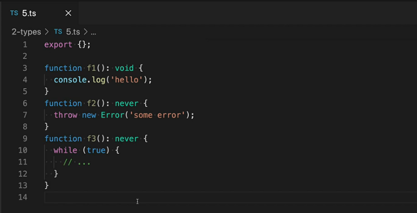

- **함수의 반환 타입**으로 `void`와 `never` 사용
- `void` : 아무 값도 반환하지 않고 종료되는 함수의 반환 타입
- `never` : 항상 예외가 발생해서 비정상적으로 종료되거나 무한루프 때문에 종료되지 않는 함수의 반환 타입.
  - never는 거의 사용되지 않음

### 객체 타입

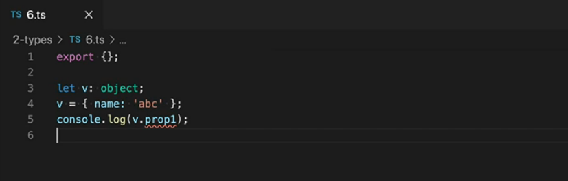

- 객체 타입 : `object`
- 객체 속성 정보가 없어서 라인5와 같이 특정 속성값에 접근하면 타입 에러가 발생함.
- 속성 정보를 포함해서 타입을 정의하기 위해서는 인터페이스를 사용해야 함. 

### 유니온 타입

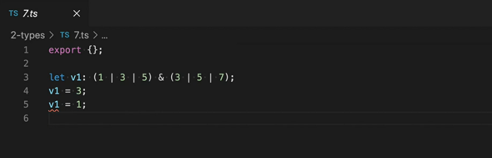

- `|(union 타입)`과 `&(intersection 타입)`을 활용해 교집합과 합집합 표현 가능

### type 키워드

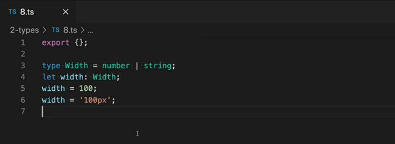

- type 키워드를 이용해 타입에 별칭을 줄 수 있다.
- number 또는 string을 타입으로 가질 수 있는 `Width`라는 타입을 정의.
- 아래 4번 라인에서 그 타입을 사용하고 있음 => 숫자와 문자 모두 입력 가능

### enum 타입

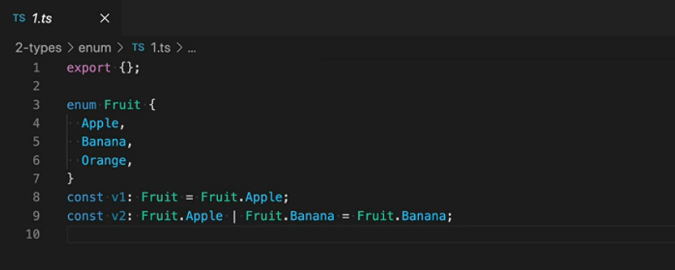

- js엔 없고 ts에만 있는 `enum` 타입.

- Fruit라는 `enum`을 정의해 안에 각각 `Apple`, `Banana`, `Orange`라는 아이템을 넣어둠. `Fruit`와 안에 있는 아이템들은 각각 **타입으로 사용**될 수 있다.
- Fruit 안에 있는 원소는 **타입** 뿐만 아니라 **값**으로도 사용할 수 있다.

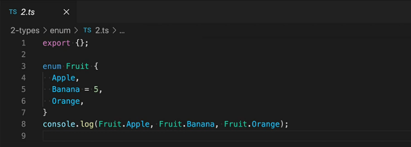

- `enum`의 첫번째 원소에 값을 할당하지 않으면 자동으로 0이 할당됨.
- `enum`의 각 원소에는 **숫자 또는 문자열**을 할당 가능.
- 명시적으로 값을 입력하지 않으면 **이전 원소에서 1만큼 증가한 값**이 할당됨.

- 즉 `Orange`에는 5+1인 6이 할당됨
- `console.log`결과 : 0 5 6

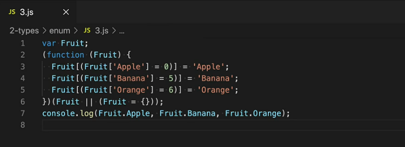

- 위의 코드들을 js로 컴파일한 결과.
- 위와 같이 `enum`의 각 원소는 이름과 값이 **양방향으로 맵핑**됨.

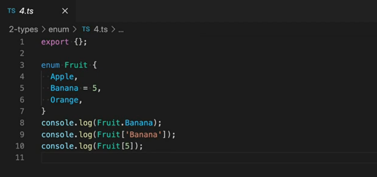

- `enum`은 객체로 존재하기 때문에 해당 객체를 run time에 사용할 수도 있다.
- 8, 9번 라인의 출력결과는 같다.
- `console.log`결과 : 5 5 Banana

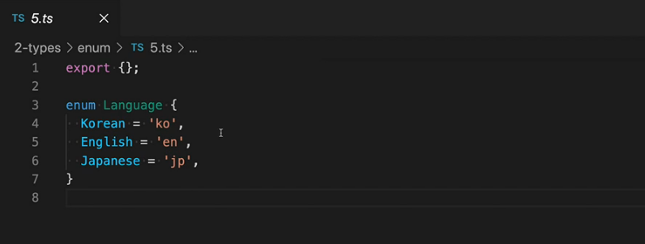

- `enum` 아이템의 값은 숫자뿐만 아니라 문자열도 입력 가능.

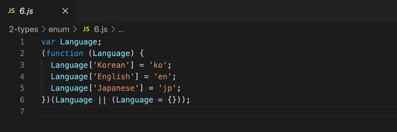

- 위의 코드들을 js로 컴파일한 결과.

- Fruit의 경우와는 조금 코드가 다름. `enum`의 각 원소에 문자열을 할당하는 경우에는 **단방향으로 맵핑**됨.

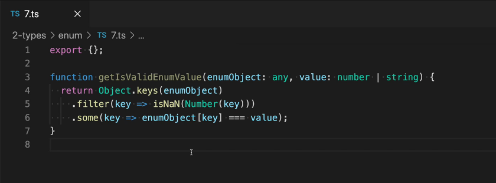

- `enum` 객체의 구조를 이해하면 이런 유틸리티 함수를 작성할 수 있음
-  이 함수는 어떤 enum 객체에 특정 value가 있는지 검사하는 함수.
- enumObject 객체에서 모든 key를 뽑아낸 다음에 마지막에는 enum 객체 안에 입력된 value가 있는지 검사하는것.
- 중간에 filter를 하는 이유는 **양방향 맵핑** 때문!

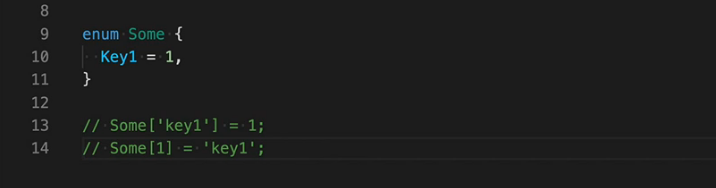

- some이라는 enum 객체 안에 `key1 = 1`를 넣었을때 13, 14번 라인처럼 양방향으로 맵핑이 된다. filter를 통해 이러한 양방향의 경우를 지워주는 것.

  => value에 `1`이 입력되면 `true`, `'key1'`이 입력되면 `false`로 출력됨

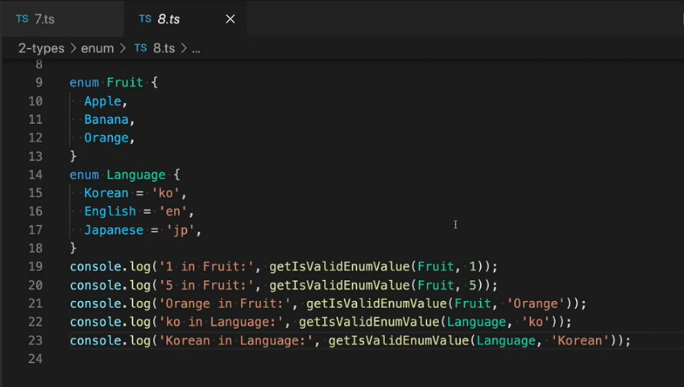

- 위에 작성한 `getIsValidEnumValue`함수를 이용해서 `console.log`를 실행해보면 순서대로 `true, false, false, true, false`가 출력된다.

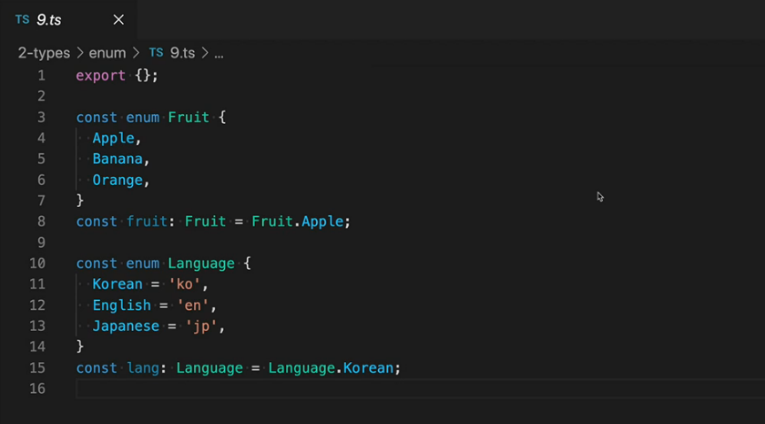

- `enum`을 사용하면 컴파일 후에도 `enum` 객체가 남아있기 때문에 번들 파일의 크기가 불필요하게 커질 수 있다.
- enum 객체에 접근하지 않는다면 굳이 컴파일 후에 객체로 남겨놓을 필요 X
- 그럴땐 `const enum`을 사용해서 컴파일 결과에 `enum`의 객체를 지울수 있다

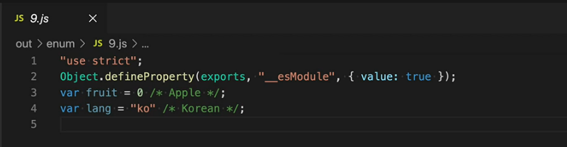

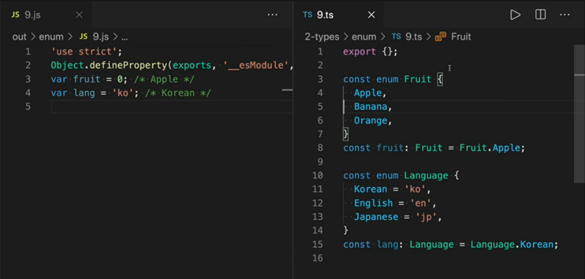

- 위의 코드들을 js로 컴파일한 결과.
- enum 객체가 안 보이고 사용한 값만 노출되고 있다!

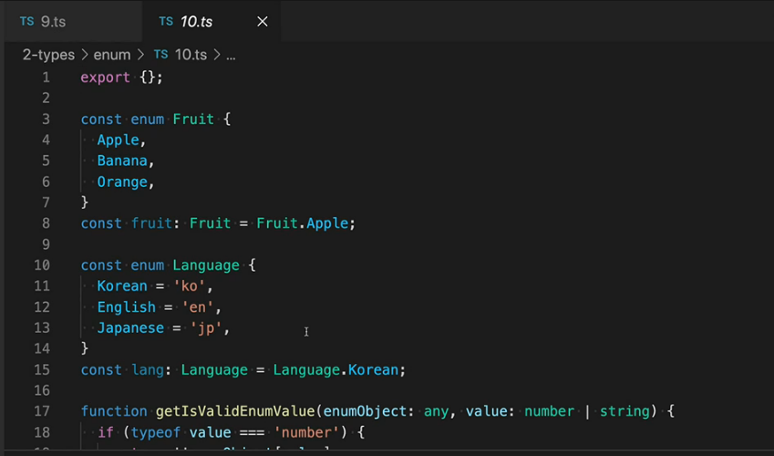

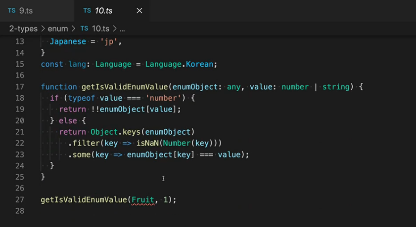

- `const enum`을 사용하면 앞에서 작성했던 `getIsValidEnumValue()`같은 유틸리티 함수를 사용할 수 없다. => **Fruit라는 enum 객체가 없기 때문!**
- 이런 경우 const enum이기 때문에 사용할 수 없다고 에러를 알려준다
- 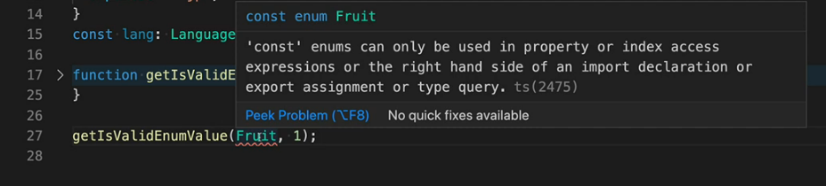

