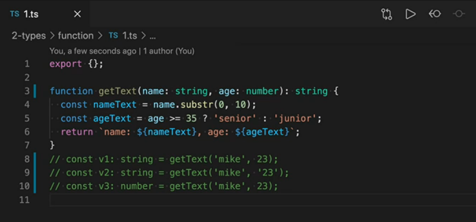
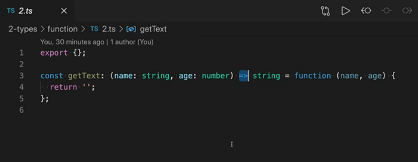
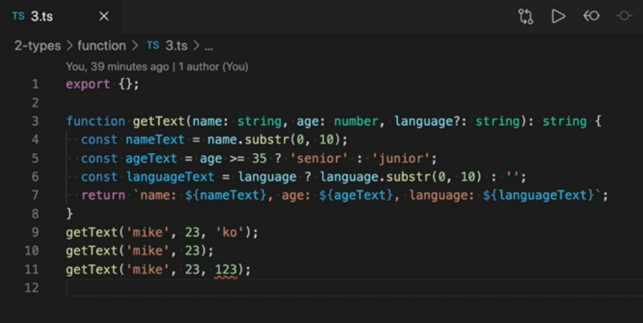
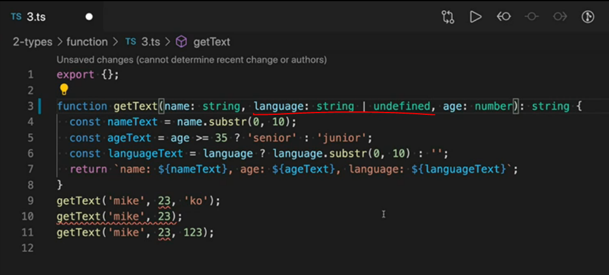
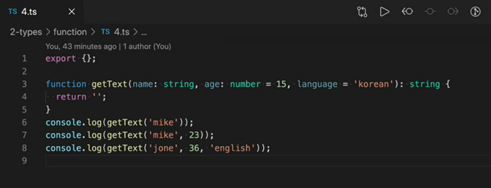
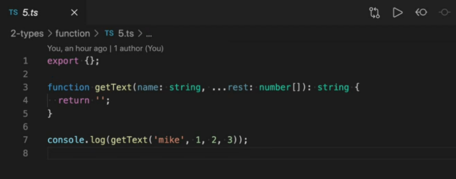

# 타입 정의하기_함수타입

### 함수 타입

- 매개변수 타입정의 :  `:(콜론)` 뒤에 타입을 정의한다. ex) `(name: string)`
- 함수 반환 타입정의 : `()` 뒤에 `:(콜론)` 뒤에 타입을 정의한다.
  - ex) function getText(name: string, age: number)**`: string`**<- 요부분

- 함수를 저장할 변수의 타입은 위와 같이 화살표 기호(화살표 함수X) 사용.
- 함수 구현 코드에선 따로 타입을 정의하지 않아도 됨.

- 매개변수 이름에 물음표를 붙이면 선택 매개변수(optional parameter)가 된다.
- 위의 그림에서 language는 `string`과 `undefined` 모두 가능하다. 

- 선택 매개변수 오른쪽에 필수 매개변수가 오면 컴파일 에러가 발생한다.
- 때문에 가운데에 쓸땐 위와 같이 써야함.
- BUT 가독성이 좋지 않으므로 매개변수가 많은 경우에는 비구조화 문법을 이용해서 이름이 있는 named parameters로 작성하는게 좋다.

- 매개변수에 기본값을 입력하는 코드.
- `language = 'korean'` 처럼 기본값을 넣어두면 타입을 정의하지 않아도 자동으로 `string`이라는 타입 정보가 들어가게 된다.

- `...rest` : 나머지 매개변수(rest parameters). 항상 배열로 정의해야 함.
-  첫번째 매개변수 입력 후 뒤에 입력하는 모든 것을 rest 매개변수에 넣는 것.