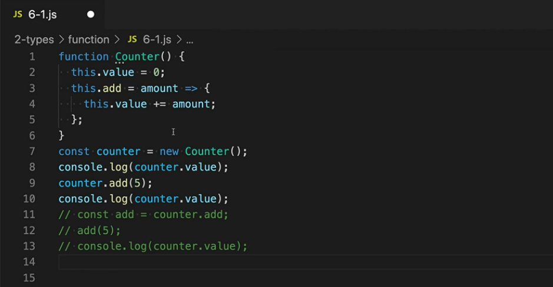
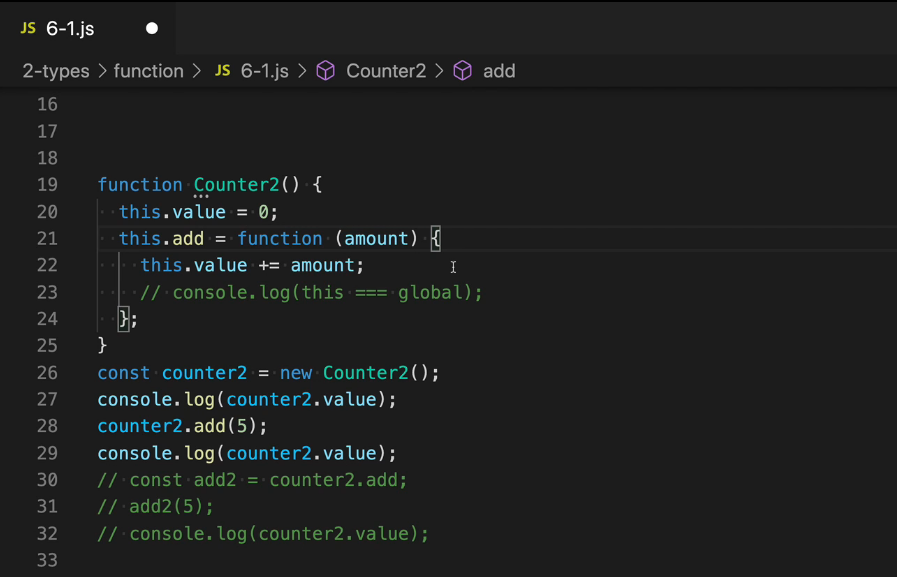
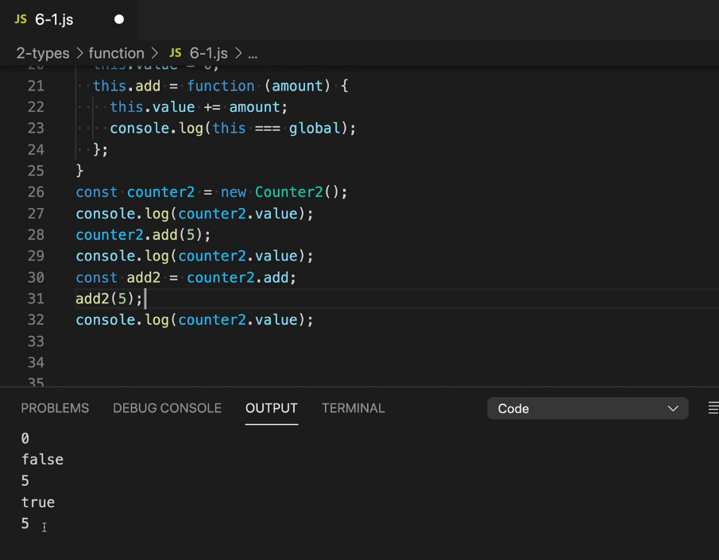
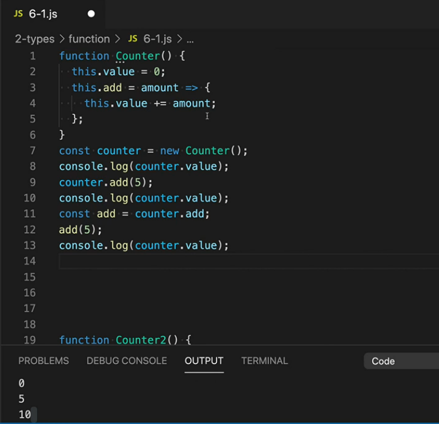
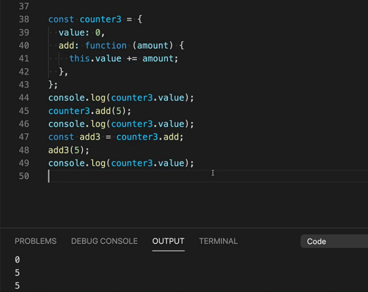
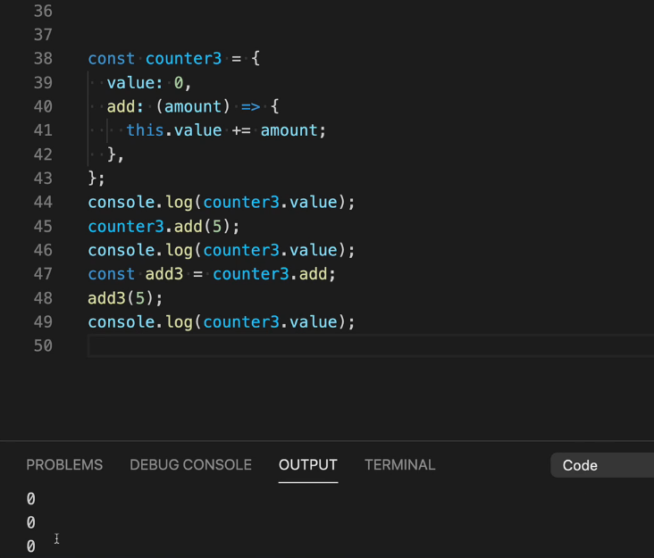

# 자바스크립트 this 이해하기

- counter 인스턴스를 새로 생성함. this가 각각 value와 add 함수를 가리키고 있음.

- 위 함수와 달리 화살표 함수가 아닌 일반 함수로 add를 정의함.
- 이럴 경우 `this`가 가리키는게 조금 다를 수 있다.

- 32번째 줄의 value가 10일것 같은데 10이 아닌 이유는 31번 줄의 `this`는 global 객체를 가리키고 28번 줄의 `this`는 global 객체를 가리키는게 아니기 때문.

- 하지만 같은 코드를 **화살표 함수**를 사용한다면 10이 출력된다.

- **화살표 함수**의 `this`는 이 화살표 함수가 생성될 당시의 `this`를 가리키기 때문. 즉 화살표 함수의 `this`는 **정적**이라고 할 수 있다.
- 반대로 **일반 함수**의 경우 호출될 당시의 상황에 따라서 `this`가 바뀌기 때문에 **동적**이라고 할 수 있다. 

- 함수가 아닌 **객체**로 만들었을 때도 add가 **일반 함수**일 경우 0 5 10이 아닌 0 5 5가 출력된다.

- 40번째 줄을 **화살표 함수**로 바꾸면 0 0 0이 출력된다.
- 41번째 줄의 `this`가 가리키는게 무엇인지 생각해보면 되는데, 40번 줄의 화살표 함수가 생성될 당시의 `this`는 add 화살표 함수를 감싸고 있는 일반 함수가 없기  때문에 항상 **전역 객체**를 가리키게 된다. 따라서 41번 라인의 코드가 아무리 실행되어도 counter3 객체의 value가 증가하지 않는 것. **this가 39번째 줄의 value를 가리키는게 아니기 때문에.**

