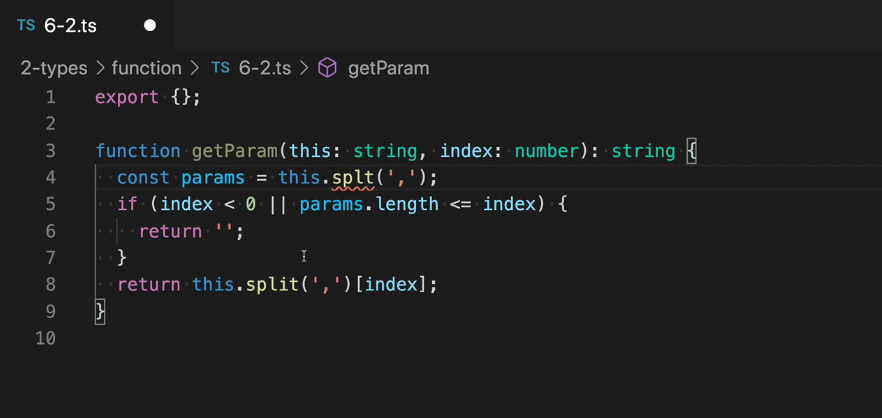
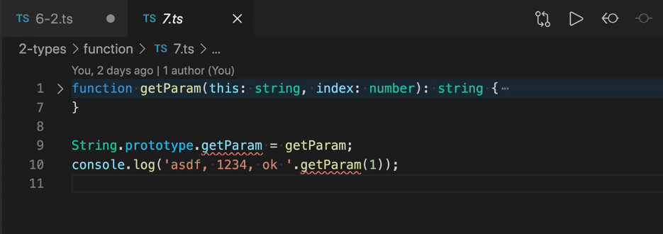
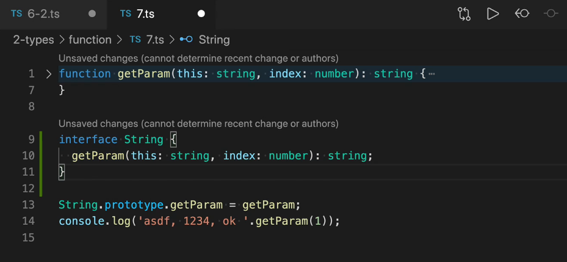
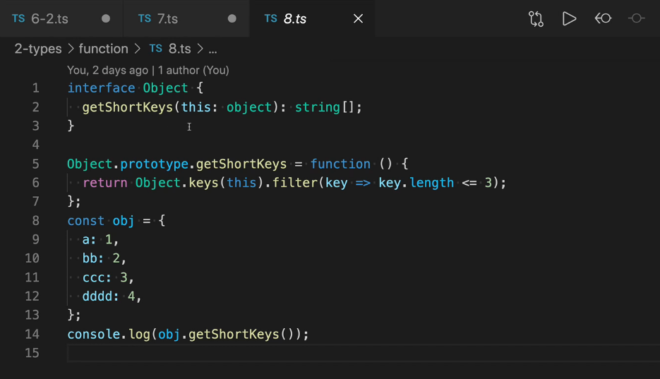
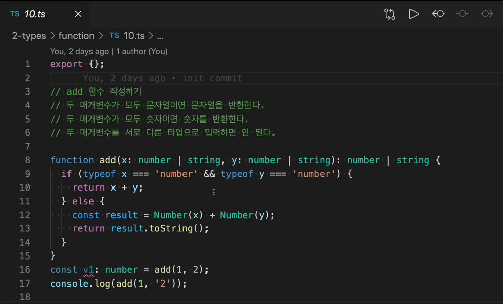
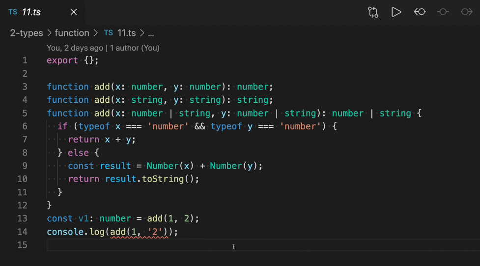
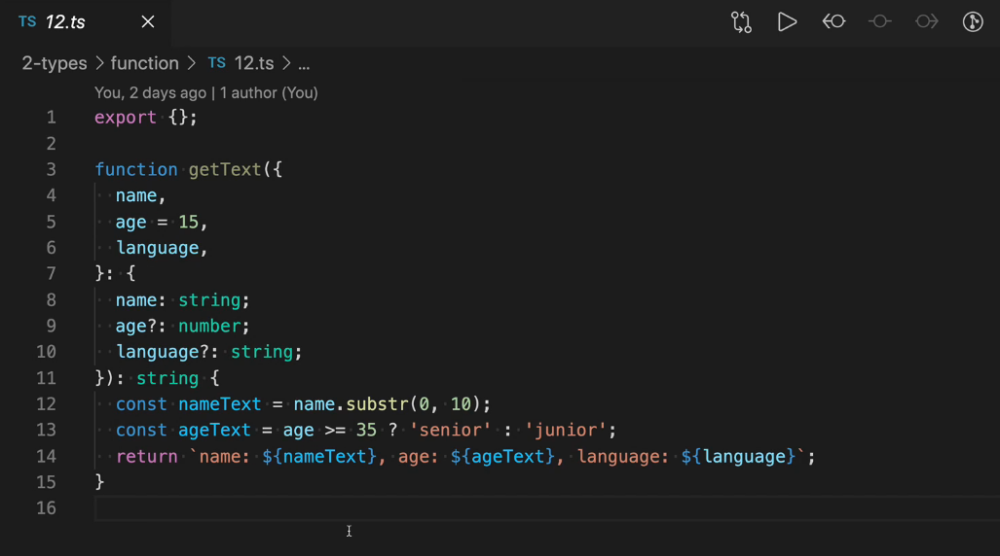
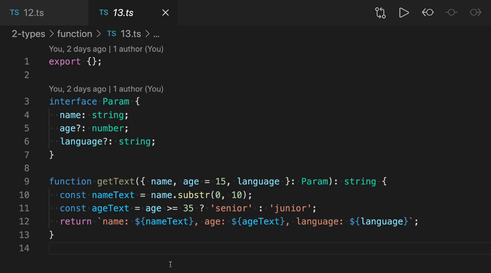
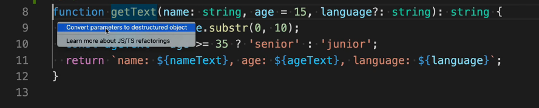

# 타입 정의하기_함수타입2

### this 타입

- 맨 앞에 `this :`를 넣으면 this의 타입을 정의할 수 있다.
- this를 먼저 쓰면 함수의 매개변수는 두번째부터 시작함.
- this의 타입을 정의했기 때문에 4번 라인에서 오타를 감지하고 에러를 표시함.

- js에 내장된 타입에 기능을 주입하고 싶을 땐 `prototype`을 이용해서 주입할 수 있다.
- 9번 라인의 getParam이라는 속성이 이 타입에 정의되어 있지 않기 때문에 에러가 나고 있음.

- String이라는 내장 타입에 속성을 추가하고 싶을 땐 **interface**를 이용할 수 있다. 그럼 에러도 사라짐! 

- Object도 마찬가지로 object에 getShortKeys라는 메서드의 타입을 정의하고 prototype을 이용해서 어떤 기능을 주입할 수 있다. 
- 14번째 줄처럼 일반적인 객체에 `.`으로 getShortKeys를 호출할 수 있게 됨.

- 위와 같은 조건을 만족시키는 add 함수 작성을 해봄.
- 하지만 둘다 숫자인 경우에는 괜찮지만 하나가 string일 경우 에러가 나고 있음. (16번 줄) => add는 string도 반환 가능하기 때문에 string을 반환하게 되면 number가 아니라서 에러가 나고 있다.

- 현재 정의된 타입으로는 둘다 number일 경우 반드시 number로 반환된다는 보장이 없기 때문. (타입 정의가 안되어있기 때문!)
- 또한 17번째줄 같은 두 매개변수를 다른 타입으로 입력해도 문제없이 반환하고 있기 때문에 요구사항을 만족시키지 못함.
- 이러한 문제점은 **함수 오버로드**를 사용해서 해결할 수 있다!

- 3, 4번째에 추가된 코드들. 반환 타입을 정의해서 문제 해결.

- 매개변수에 이름을 부여하는 named parameters 작성법 : 3번 라인처럼 전체를 객체로 감싸주고 그 뒤에 타입을 정의해주기. (7~10번 라인 부분)

- 이 함수를 사용할 땐 `getText({name: 'aaa', age: 11, language: ''})`와 같이 이름을 적어서 사용할 수 있다.

- named parameters의 타입 정보를 다른 곳에서도 사용하고 싶다면 interface로 정의해두고 그것을 9번 라인  `: Param`와 같이 적어주면 됨.
- interface로 정의해둔 타입 정보는 나중에 다른 곳에서도 사용할 수 있음.
- 매개 변수가 많을 땐 named parameters로 작성하는게 좋다.

- named parameters로 변경하는 과정은 꽤나 번거로운데, 타입스크립트에선 named parameters로 변경하는 리팩토링 기능을 제공한다!