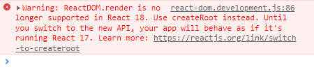

리액트 18에서 바꿔야하는것

## before

```react
import React from "react";
import ReactDOM from "react-dom";
import "./index.css";
import App from "./App";
import reportWebVitals from "./reportWebVitals";
import GlobalStyles from "./styles/GlobalStyles";

ReactDOM.render(
  <React.StrictMode>
    <GlobalStyles />
    <App />
  </React.StrictMode>,
  document.getElementById("root")
);

reportWebVitals();
```

이대로 사용하면



이런 경고창이 뜬다.

- 새로 나온 리액트 18에서는 ReactDOM.render가 아니라, createRoot를 사용해야 한다는 것 같다.

그래서 이렇게 바꿔줌

## after

```React
import React from "react";
import ReactDOM from "react-dom/client";
import "./index.css";
import App from "./App";
import reportWebVitals from "./reportWebVitals";
import GlobalStyles from "./styles/GlobalStyles";

const rootNode = document.getElementById("root");

ReactDOM.createRoot(rootNode).render(
  <React.StrictMode>
    <GlobalStyles />
    <App />
  </React.StrictMode>
);

reportWebVitals();
```


참고 : https://velog.io/@citron03/React-18%EC%97%90%EC%84%9C-ReactDOM.render%EC%99%80-createRoot