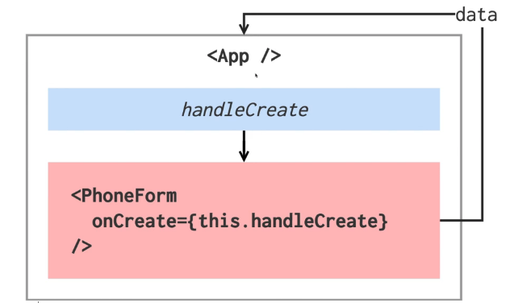

# React 설치 및 시작

## CRA를 이용

```bash
$ npx create-react-app 폴더명
$ cd 폴더명
$ yarn start // react 시작
```

배포할 때 쓰는 명령어 `yarn build`

확장프로그램 reactjs code snippet 다운 후 `rcc + tab` 입력하면 자동으로 class 형태로 만들어진 컴포넌트 생성 / `rsc + tab` 은 함수형 컴포넌트


## 자식 컴포넌트가 부모에게 값 전달



App.js에서 `handleCreate`라는 메서드를 만들고 자식 컴포넌트에게 props로 전달.

그리고 자식 컴포넌트인 PhoneFrom에서 props로 전달한 함수를 호출시켜서 data 값이 App에게 들어가게끔 작성.

array에 새로운 값을 넣어 반환할때는 `.concat()`을 사용. [concat](https://developer.mozilla.org/ko/docs/Web/JavaScript/Reference/Global_Objects/Array/concat)

- App.js
  - 자식 컴포넌트 PhoneForm으로부터 데이터 받아오기

```react
import React, { Component } from 'react';
import PhoneForm from './components/PhoneForm';

class App extends Component {

  state = {
    info: [], // handleCreate에서 받아온 자식 data를 app에도 넣어주기
  }
  
  handleCreate = (data) => {
    console.log(data)
    // info 배열에 data 넣겠다고 this.state.info.push(data) 이렇게 하면 안됨
    // this.setState({ info: this.state.info }) 이것도 안됨..
    // 리액트는 불변성을 유지해줘야하므로 concat이라는 내장함수 사용!
    // 비구조화 할당 문법을 사용하면 코드가 짧아진다
    const { info } = this.state
    this.setState({
      info: info.concat(data)
      // info: this.state.info.concat(data)
    })
  }

  render() {
    return (
      <div>
        <PhoneForm onCreate={this.handleCreate} />        
        {JSON.stringify(this.state.info)} {/* string 형태로 JSON 반환 */}
      </div>
    );
  }
}

export default App;
```

- PhoneForm.js
  - 이름과 전화번호 값 input
  - 그 값을 부모 컴포넌트인 App에게 보내줌

```react
import React, { Component } from 'react';

class PhoneForm extends Component {

  state = {
    name: '',
    phone: '',
  }

  // e는 이벤트 객체. 파라미터로 받아옴
  handleChanege = (e) => {
    this.setState({
      // e.target = input
      [e.target.name]: e.target.value
    })
  }

  handleSubmit = (e) => {
    e.preventDefault(); // form 특유의 submit 기능을 방지
    this.props.onCreate(this.state) // submit하면 App으로 state값 보냄
    // 넣어둔 입력값 초기화
    this.setState({
      name: '',
      phone: '',
    })
  }

  render() {
    return (
      <form onSubmit={this.handleSubmit}>
        <input
          name='name'
          placeholder='이름'
          onChange={this.handleChanege}
          value={this.state.name}
        />
        <input
          name='phone'
          placeholder='전화번호'
          onChange={this.handleChanege}
          value={this.state.phone}
        />
        <button type='submit'>등록</button>
        {/* <div> 현재 입력값 보여주기
          {this.state.name} {this.state.phone}
        </div> */}
      </form>
    );
  }
}

export default PhoneForm;
```


---

- App에서 각 데이터마다 id 지정해주기. PhoneForm은 그대로 둠.
  - id를 state에 넣지 않은 이유? id 값은 렌더링 되는 값이 아니기 때문에 굳이 state에 넣어줄 필요 없다! `setState`를 사용하는 이유는 어떤 값이 수정됐을때 리렌더링하기 위함인데 id값은 리렌더링 될 필요가 없기 때문.

```react
import React, { Component } from 'react';
import PhoneForm from './components/PhoneForm';

class App extends Component {

  id = 0

  state = {
    info: [], 
  }
  
  handleCreate = (data) => {
    // 비구조화 할당 문법을 사용하면 코드가 짧아진다
    const { info } = this.state
    this.setState({
      info: info.concat({
        ...data,
        id: this.id++
      })
    })
  }

  render() {
    return (
      <div>
        <PhoneForm onCreate={this.handleCreate} />        
        {JSON.stringify(this.state.info)}
      </div>
    );
  }
}

export default App;
```

- handleCreate 함수의 `concat()` 은`...data` 말고도 쓰는 방법이 다양하다.

  1. 가장 기본

  ```react
  handleCreate = (data) => {
      const { info } = this.state
      this.setState({
        info: info.concat({
          name: data.name,
          phone: data.phone,
          id: this.id++
        })
      })
    }
  ```

  2. `Object.assign()` 함수 사용

  ```react
  handleCreate = (data) => {
      const { info } = this.state
      this.setState({
        // 첫번째의 비어있는 객체에 data를 집어넣고
        // 세번째의 {id: this.id++}도 넣는다는 의미
        info: info.concat(Object.assign({}, data, {
          id: this.id++
        }))
      })
    }
  ```

  

---


