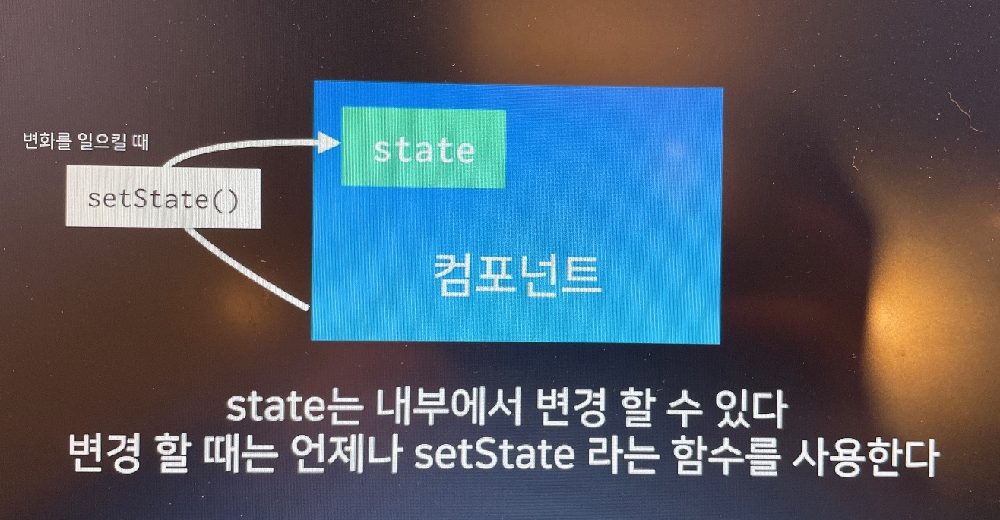

# React

## 1. react 기본

- MVC, MVVM, MVW

- virtual DOM : 가상의 DOM. 변화가 일어나면, 실제로 브라우저의 DOM 에 새로운걸 넣는것이 아니라, 자바스크립트로 이뤄진 가상 DOM 에 한번 렌더링을 하고, 기존의 DOM 과 비교를 한 다음에 정말 변화가 필요한 곳에만 업데이트를 해주는 것.


리액트를 쓸때는 반드시 import로 불러와야함

```javascript
import React, { Component } from 'react';
```


### 컴포넌트를 만드는 2가지 방법

1. class를 통해 만들기

   ```react
import React, { Component } from 'react';
    
   class App extends Component {
    render() {
        return (
          <div>
            <h1>안녕하세요 리액트</h1>
          </div>
        );
      }
    }
    
    export default App;
   ```

   
    render 메소드에는 반드시 js 형태의 코드를 리턴해줘야한다.
   
2. 함수를 통해 만들기

    ```react
    import React from 'react';
    // 함수형 컴포넌트는 코드 상단에서 { component }를 불러오지 않아도 됨
    
    // ({ name }) 이 부분은 비구조화 할당이라고 부름.
    const MyName = ({ name }) => {
      return (
        <div>
          안녕하세요, 제 이름은 {name} 입니다.
        </div>
      )
    }
    
    MyName.defaultProps = {
      name: '이산하'
    };
    
    export default MyName;
    ```

- [비구조화 할당 문법 참고](https://developer.mozilla.org/ko/docs/Web/JavaScript/Reference/Operators/Destructuring_assignment)

- 함수형 컴포넌트는 초기 mount 속도가 미세하게 조금 더 빠름

- 불필요한 기능이 없어 메모리 자원도 덜 사용함

- 그러므로 위의 예시처럼 단순히 어떤 값을 받아와서 보여주기만 하는 용도라면 class보단 함수형 컴포넌트를 만드는게 낫다. (속도 최적화)

  

## 2. JSX

HTML과 비슷하지만 지켜야 할 규칙이 몇가지 있다.

- 태그는 꼭 닫혀있어야 한다. (EX. input 태그)

  - self closing tag `<input type="text" />` 형식으로 닫자

- 두 개 이상의 엘리먼트는 무조건 하나의 엘리먼트로 감싸져 있어야 한다.

  - 이 번거로움을 없애기 위해 Fragment 라는게 생김. 불필요한 div를 없앨수 있다.

  ```react
  import React, { Component, Fragment } from 'react';
  
  class App extends Component {
    render() {
      return (
        <Fragment>
        	<div>
            <h1>안녕하세요 리액트</h1>
          </div>
          <div>bye</div>
        </Fragment>
      );
    }
  }
  ```


- JSX 내부에서 JS 값 사용하기

  ```react
  import React, { Component, Fragment } from 'react';
  
  class App extends Component {
    render() {
      const name = 'react'
      return (
        <div>
          hello {name}
        </div>      
      );
    }
  }
  ```


- 리액트에서 스타일 적용하기

  ```react
  import React, { Component, Fragment } from 'react';
  
  class App extends Component {
    render() {
      const style = {
        backgroundColor: 'black',
        padding: '16px',
        color: 'white',
        fontSize: '36px'
        // fontSize: 4 + 10 + 'px' 이런 표현도 가능
      }
  
      return <div style={style}>안녕!</div>
    }
  }
  
  export default App;
  ```


 - 리액트에서 class 사용하기

   ```react
   import React, { Component } from 'react';
   import './App.css';	// css 불러옴(같은 폴더 위치)
   
   class App extends Component {
     render() {
       const style = {
         backgroundColor: 'black',
         padding: '16px',
         color: '#fff',
         fontSize: '36px'
       };
   
       return (
         // className으로 class 이름 부여
         <div className="App">
           안녕!
           {/* 리액트 안쪽에 주석은 이렇게 만들어~ */}
         </div>
       );
     }
   }
   
   export default App;
   ```


## 3. props

- 부모 컴포넌트가 자식 컴포넌트에게 값을 전달할 때 사용

- 부모 컴포넌트인 App에서 자식 컴포넌트인 Myname으로 name 값을 넘겨주고 있다

- 부모 컴포넌트 App

  ```react
  import React, { Component } from 'react';
  import MyName from './MyName';
  
  class App extends Component {
    render() {
      return <MyName name="리액트" />;
    }
  }
  
  export default App;
  ```


- 자식 컴포넌트인 MyName

  ```react
  import React, { Component } from 'react';
  
  class MyName extends Component {
    // props 값을 받아오지 않을 경우를 대비해 defaultProps를 설정할 수 있다. class 내부에 static 값을 선언하면 됨.  
    static defaultProps = {
      name: '기본 이름'
    };
  
    render() {
      return (
        <div>
          내 이름은 <b>{this.props.name}</b>입니다.
        </div>
      );
    }
  }
  
  export default MyName;
  ```


- 디폴트 props를 설정하는 또다른 방식

  ```react
  import React, { Component } from 'react';
  
  class MyName extends Component {
    render() {
      return (
        <div>
          히히히 내 이름은 <b>{this.props.name}</b>입니다.
        </div>
      );
    }
  }
  //// 여기 class 하단에 선언해서 default props 설정 가능
  //하지만 위의 static을 이용한 방법이 좀더 최신 방법임.
  MyName.defaultProps = {
    name: '이산하'
  };
  
  export default MyName;
  ```


## 4. state

- state는 내부에서 변경할 수 있다. state를 변경할 때는 언제나 `setState`라는 함수를 사용한다.

  

- class 내부에 state 선언. 다른 값은 안된다. 무조건 object여야함.

- 간단한 카운터 만들기

  ```react
  import React, { Component } from 'react';
  
  class Counter extends Component {
    state = {
      number: 1
    };
  
    handleIncrease = () => {
      // this.state.number = this.state.number + 1
      // 이런 코드는 절대 안됨! 컴포넌트에서 state에서 업뎃이 됐는지 안 됐는지 컴포넌트 자신도 모르게 됨
      this.setState({
        number: this.state.number + 1
      });
    };
  
    // handleDecrease() {} <- 이런 일반 함수가 아닌
    // 화살표 함수로 작성한 이유?
    // 함수 내부에서 this가 뭔지 모르게 됨. undefined 에러 발생
    handleDecrease = () => {
      this.setState({
        number: this.state.number - 1
      });
    };
  
    render() {
      return (
        <div>
          <h1>카운터</h1>
          <div>값 : {this.state.number}</div>
          <button onClick={this.handleIncrease}>+</button>
          <button onClick={this.handleDecrease}>-</button>
        </div>
      );
    }
  }
  
  export default Counter;
  ```


  - handleIncrease 함수를 화살표 함수가 아닌 일반 함수로 작성하는 방법

    ```react
      import React, { Component } from 'react';
      
      class Counter extends Component {
        state = {
          number: 1
        };
      
      // constructor라는 것을 추가한다
      // 하지만 복잡하니 그냥 처음부터 화살표 함수로 쓰는게 좋다
        constructor(props) {
          super(props)
          this.handleIncrease = this.handleIncrease.bind(this)
          this.handleDecrease = this.handleDecrease.bind(this)
        }
      
        handleIncrease() {
          console.log(this)
          this.setState({
            number: this.state.number + 1
          });
        };
      
        handleDecrease() {
          this.setState({
            number: this.state.number - 1
          });
        };
      
        render() {
          return (
            <div>
              <h1>카운터</h1>
              <div>값 : {this.state.number}</div>
              <button onClick={this.handleIncrease}>+</button>
              <button onClick={this.handleDecrease}>-</button>
            </div>
          );
        }
      }
      
      export default Counter;
    ```

    

## 5. Life cycle API

일명 생명주기. 

1. (컴포넌트가 브라우저 상에서 ) 나타날 때 **(mounting)**
2. 업데이트 될 때 **(updating)**
3. 사라질 때 **(unmounting)**


#### Mounting

- constructor : 생성자 함수. 컴포넌트가 새로 만들어질 때 가장 먼저 실행되는 함수.
- getDerivedStateFromProps : 주로 props로 받은 값을 state에 그대로 동기화 시키고 싶을때 사용.
- render : 어떤 DOM을 만들게 될지 정의
- componentDidMount : 컴포넌트가 브라우저 상에 나타날때(나타난 시점) 호출되는 API. 주로 외부 라이브러리 (EX. 차트 라이브러리) 불러올 때 사용. 또는 네트워크 요청할 때. 컴포넌트가 나타난 뒤 몇초뒤 뭘 하고 싶다, 컴포넌트가 나타난 다음 어떤 이벤트를 읽고싶을 때(이벤트 리스닝) 사용.
  - 외부 라이브러리 연동 : D3, masonry, etc
  - 컴포넌트에 필요한 데이터 요청 : AJAX, GraphQL, etc
  - DOM에 관련된 작업 : 스크롤 설정, 크기 읽어오기 등

#### Updating

- **shouldComponentUpdate**(nextProps, nextState) : 컴포넌트가 업데이트 되는 성능을 **최적화**시키고 싶을 때 사용. true / false 값을 반환 가능. return false 하면 업데이트 안 함. virtual DOM에도 렌더링을 할지말지 결정하는 함수라고 보면 됨.

  - 렌더링을 한다는건, render() 함수가 호출된다는 의미

- getSnapshotBeforeUpdate(prevProps, prevState) : 렌더링 한 다음에 그 결과물이 브라우저 상에 반영되기 바로 직전에 호출되는 함수. 주로 스크롤의 위치, 해당 DOM의 크기를 사전에 가져오고 싶을때 사용.

  - 이 API가 발생하는 시점
    1. render()
    2. getSnapshotBeforeUpdate()
    3. 실제 DOM에 변화 발생
    4. componentDidUpdate
  - 이 API를 통해서 DOM 변화가 일어나기 직전의 DOM 상태를 가져오고, 여기서 리턴하는 값은 `componentDidUpdate`에서 3번째 파라미터로 받아올 수 있게 된다. 

- componentDidUpdate(prevProps, prevState, snapshot) : 작업을 마치고 컴포넌트가 업데이트 되었을때(render()를 호출한 다음) 호출되는 함수. 이 시점에선 this.props와 this.state가 바뀌어 있다. 그리고 파라미터를 통해 이전의 값인 prevProps와 prevState를 조회할 수 있다. `getSnapshotBeforeUpdate`에서 반환한 snapshot 값은 세번째 값으로 받아온다.

  예를 들어 state가 바뀌었을때 이전의 상태와 지금의 상태가 다르다? 그럼 이럴때 이러한 작업을 하겠다! 그런 명령을 내릴 수 있음. 

#### Unmounting

- componentWillUnmount : 컴포넌트가 사라지는 과정에서 호출되는 함수. `componentDidMount`에서 설정한 이벤트 리스너를 없애주는 작업을 한다.
  - 여기선 주로 등록했던 이벤트를 제거하고, 만약 `setTimeout`을 걸은게 있다면 `clearTimeout`을 통해 제거한다.
  - 추가적으로 외부 라이브러리를 사용한게 있고 해당 라이브러리에 dispose 기능이 있다면 여기서 호출해주면 된다.

---

### 실습을 통해 위의 LifeCycle API 연습해보기

- App.js

```react
import React, { Component } from 'react';
import MyComponent from './MyComponent';

class App extends Component {
  constructor(props) {
    // 컴포넌트가 원래 갖고 있던 생성자 함수를 호출해주는것
    super(props);
    console.log('constructor');
  }
  componentDidMount() {
    console.log('componentDidMount');
    console.log(this.myDiv.getBoundingClientRect());
    // DOM의 속성 값들을 가져와서 보여줌. ref와 함께 사용
  }
  render() {
    return (
      <div ref={(ref) => (this.myDiv = ref)}>
        <h1>안녕하세요 리액트</h1>
        <MyComponent value={5} />
      </div>
    );
  }
}

export default App;
```

- MyComponent.js : App.js에서 받아온 props 값이 변화함에 따라 state값을 똑같이 바꿔줌.  `getDerivedStateFromProps` 함수를 통해!

```react
import React, { Component } from 'react';

class MyComponent extends Component {
  state = {
    value: 0
  };

  // getDrivedStateFromProps 이친구는 static으로 가져와야함
  // nextProps는 다음으로 받아올 props값
  // prevState는 현재 업데이트 되기 전의 상태
  static getDerivedStateFromProps(nextProps, prevState) {
    if (prevState.value !== nextProps.value) {
      return {
        value: nextProps.value
      };
    }
    return null; // 변경 사항이 없을때 null처리해줌
  }
  render() {
    return (
      <div>
        <p>props: {this.props.value}</p>
        <p>state: {this.state.value}</p>
      </div>
    );
  }
}

export default MyComponent;
```

---

- App.js 
  - 클릭하면 state의 counter 값을 1씩 올려주는 버튼 추가. 
  - `&&` 로 10 이하일 때만 보이도록 조건을 설정해둠

```react
import React, { Component } from 'react';
import MyComponent from './MyComponent';

class App extends Component {
  state = {
    counter: 1
  };
  constructor(props) {
    // 컴포넌트가 원래 갖고 있던 생성자 함수를 호출해주는것
    super(props);
    console.log('constructor');
  }
  componentDidMount() {
    console.log('componentDidMount');
    // console.log(this.myDiv.getBoundingClientRect());
  }
  handleClick = () => {
    this.setState({
      counter: this.state.counter + 1
    });
  };

  render() {
    return (
      <div>
        {this.state.counter < 10 && <MyComponent value={this.state.counter} />}
        {/* &&는 왼쪽의 조건을 만족하면 오른쪽 요소를 보여주란 뜻 */}
        <button onClick={this.handleClick}>Click Me</button>
      </div>
    );
  }
};

export default App;
```

- MyComponent.js
  - `shouldComponentUpdate` 추가해서 특정 상황에서 업데이트 막아줌
  - `componentDidUpdate` 를 통해 props 값이 이전 값과 달라지면 console.log 출력
  - ` componentWillUnmount`컴포넌트가 unmount 됐을때 console.log 출력 

```react
import React, { Component } from 'react';

class MyComponent extends Component {
  state = {
    value: 0
  };

  // getDrivedStateFromProps 이친구는 static으로 가져와야함
  // nextProps는 다음으로 받아올 props값
  // prevState는 현재 업데이트 되기 전의 상태
  static getDerivedStateFromProps(nextProps, prevState) {
    if (prevState.value !== nextProps.value) {
      return {
        value: nextProps.value
      };
    }
    return null; // 변경 사항이 없을때 null처리해줌
  }

  shouldComponentUpdate(nextProps, nextState) {
    if (nextProps.value === 10) return false;
    return true;
    // 이렇게 하면 props 값이 10일때 스킵하고 11로 넘어감
  }

  componentDidUpdate(prevProps, prevState) {
    if (this.props.value !== prevProps.value) {
      console.log('value 값이 바뀌었다!', this.props.value);
    }
  }

  componentWillUnmount() {
    console.log('good bye');
  }

  render() {
    return (
      <div>
        <p>props: {this.props.value}</p>
        <p>state: {this.state.value}</p>
      </div>
    );
  }
}

export default MyComponent;
```


#### 컴포넌트에 에러 발생

- componentDidCatch(error, info)
  - 부모 컴포넌트에서 사용해야함.
  - 컴포넌트 자신의 render 함수에서 에러가 발생한 것은 잡아낼 수 없기 때문. 자식 컴포넌트의 내부 에러만 catch


- App.js
  - state에 error 추가
  - `componentDidCatch` 추가
  - 에러 발생시 사용자에게 보여질 화면 추가

```react
import React, { Component } from 'react';
import MyComponent from './MyComponent';

class App extends Component {
  state = {
    counter: 1,
    error: false
  };

  componentDidCatch(error, info) {
    // 실수로 잡지 못한 버그를 잡을때 사용
    // console.log(error);
    // console.log(info);
    this.setState({
      error: true
    });
    // API를 통해서 서버로 오류 내용 날리기
  }

  constructor(props) {
    // 컴포넌트가 원래 갖고 있던 생성자 함수를 호출해주는것
    super(props);
    console.log('constructor');
  }
  componentDidMount() {
    console.log('componentDidMount');
  }
  handleClick = () => {
    this.setState({
      counter: this.state.counter + 1
    });
  };

  render() {
    if (this.state.error) {
      return <div>에러가 발생했어요!</div>;
    }
    return (
      <div>
        {this.state.counter < 10 && <MyComponent value={this.state.counter} />}
        <button onClick={this.handleClick}>Click Me</button>
      </div>
    );
  }
}

export default App;
```

- MyComponent.js
  - render()의 return 안에 에러 추가 : `{this.props.missing.something}` 이부분

```react
import React, { Component } from 'react';

class MyComponent extends Component {
  state = {
    value: 0
  };
  
  static getDerivedStateFromProps(nextProps, prevState) {
    if (prevState.value !== nextProps.value) {
      return {
        value: nextProps.value
      };
    }
    return null; // 변경 사항이 없을때 null처리해줌
  }

  shouldComponentUpdate(nextProps, nextState) {
    if (nextProps.value === 10) return false;
    return true;
    // 이렇게 하면 props 값이 10일때 스킵하고 11로 넘어감
  }

  componentDidUpdate(prevProps, prevState) {
    if (this.props.value !== prevProps.value) {
      console.log('value 값이 바뀌었다!', this.props.value);
    }
  }

  componentWillUnmount() {
    console.log('good bye');
  }

  render() {
    return (
      <div>
        {this.props.missing.something}
        <p>props: {this.props.value}</p>
        <p>state: {this.state.value}</p>
      </div>
    );
  }
}

export default MyComponent
```


